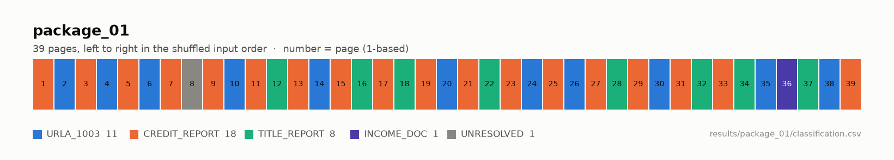
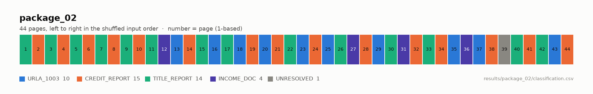

# docsplit

여러 대출 서류가 페이지 단위로 뒤섞인 하나의 PDF를 입력받아, 각 페이지를 문서
유형(`URLA_1003` / `CREDIT_REPORT` / `TITLE_REPORT` / `INCOME_DOC` / `OTHER`)으로
분류하고, 문서 단위로 다시 묶은 뒤 문서 내 페이지 순서를 복원하는 파이프라인입니다.

## 목차

- [접근 방식](#접근-방식)
- [처리 흐름](#처리-흐름)
- [결과](#결과)
- [알려진 한계와 개선 방향](#알려진-한계와-개선-방향)
- [실행 방법](#실행-방법)
- [프로젝트 구조](#프로젝트-구조)

## 접근 방식

이 섹션은 네 가지를 순서대로 답합니다 — 문제를 어떻게 나눴는가(문제 분해),
무엇으로 판정하는가(판정 기술), 규칙은 어디서 왔는가(규칙을 만든 과정 ·
유형별 설계), LLM은 어디에 쓰는가(LLM 사용 지점).

### 문제 분해

과제를 세 단계로 나눴습니다.

1. **페이지 분류** — 각 페이지가 어떤 문서 유형인지 판별합니다.
   근거는 유형이 공유하는 고정 문구입니다 (표준 양식의 푸터, 섹션 제목).
2. **그룹핑** — 같은 유형 페이지들을 문서 단위로 묶습니다.
   근거는 개별 문서에 적힌 값입니다 (차주 이름, 대출번호, 페이지 마커).
3. **순서 복원** — 각 문서 안에서 원래 페이지 순서를 되돌립니다.
   근거는 문서의 구조입니다 (페이지 마커, 표준 섹션 순서).

유형 신호와 개별 문서 신호는 역할이 달라서 단계 간에 섞어 쓰지 않았습니다.

그룹핑을 따로 둔 건 같은 유형 문서가 한 패키지에 여러 벌 있을 수 있어서입니다.
실제로 package_02에는 같은 거래의 Title Commitment 출력본이 세 벌 섞여 있었습니다.

### 판정 기술 — 규칙 → LLM → 미확정

이 도메인의 문서들은 표준 양식·정부 서식 기반이라, 유형을 확정하는 고정
문구(GSE 푸터, IRS transcript 헤더, ALTA 고지)가 존재합니다. 고정 문구가
있는 곳에서는 결정론적 규칙이 LLM보다 싸고, 재현 가능하고, 문구 단위로
설명 가능합니다. 그래서 규칙을 1차 판정으로 두고, LLM(gpt-5.4-mini)은
규칙이 성립하지 않는 곳 — 자유 양식 문서, 텍스트 없는 스캔, 문서 단위
판단 — 에만 썼습니다. LLM도 확신하지 못하면 억지로 배정하지 않고
미확정(`UNRESOLVED`)으로 남깁니다.

실측으로 두 패키지 83페이지 중 73장(88%)이 규칙으로 확정됐고, LLM 호출은
완주 기준 18회·$0.069였습니다.

이 판정 구조를 지탱하는 원칙 세 가지입니다.

1. **규칙은 데이터가 아니라 준거 문서에서 추출했습니다.** 정답이 있는 패키지가
   39페이지뿐이라 여기서 규칙을 뽑으면 표본 과적합이라 생각했고, 유형별 준거
   문서(공식 표준 양식·정부 발행물·벤더 제품 문서)를 직접 확보해 규칙을
   추출했습니다. 데이터는 대조 용도로만 썼습니다.
2. **신호를 결정적/지지적 두 등급으로 나누고, 등급별 통과 기준을 정했습니다.**
   결정적 신호 1개면 확정(RULE_HIGH), 서로 다른 지지적 신호 2개면
   판정(RULE_MEDIUM), 그 미만이면 LLM으로 넘깁니다. 통과 기준이 신호 1개·2개뿐이라
   데이터에 맞춰 조정할 값 자체가 없습니다.
3. **LLM은 규칙이 확신하지 못하는 곳에만 씁니다.** 미확정 페이지 분류, 텍스트
   없는 스캔 페이지의 비전 판정, 그룹핑의 판단에 사용하고, 모든 판단에
   근거(evidence)를 남기게 했습니다. 순서 복원에는 LLM을 쓰지 않습니다.

검토했지만 채택하지 않은 방법:

| 대안 | 배제 이유 |
|---|---|
| supervised ML 분류기 | 표본 39페이지, 클래스 불균형(INCOME 1장), 문서 다양성 부재 → 학습 불성립. 성립해 보여도 표본 과적합 |
| 단순 키워드 빈도 매칭 | 소득 어휘(`Income`, `Employer`)가 정작 URLA 신청서에 더 많이 등장함을 측정으로 확인 — 어휘 빈도가 아니라 문구의 출처(표준이 강제하는지)로 판정 |
| 전 페이지 LLM 분류 | 규칙만으로 대부분 확정되는 상황에서 전량 LLM은 비용·재현성·설명력 모두 불리 |
| OCR 전면 도입 | 83페이지 중 텍스트 레이어 없는 페이지는 3장뿐 — 그 3장은 OCR 대신 VLM 비전 판정으로 처리 |
| 임의 가중치 점수제 | 왜 그 숫자인지 답할 수 없는 값은 배제 |
| 페이지 번호 기반 분류 | 표준 blank에 페이지 번호 부재를 확인. 렌더링 산물은 분류가 아니라 그룹핑 신호로 사용 |

### 규칙을 만든 과정

**1. 준거 문서 확보** — 유형별 공식 표준 양식·정부 발행물·벤더 제품 문서를
직접 확보했습니다. 문서는 [`data/reference/`](data/reference/)에, 출처는 유형별
`SOURCES.md`([URLA](data/reference/urla/SOURCES.md) ·
[CREDIT](data/reference/credit/xactus/SOURCES.md) ·
[TITLE](data/reference/title/SOURCES.md) ·
[INCOME](data/reference/income/SOURCES.md))에 있습니다.

| 유형 | 확보한 준거 문서 |
|---|---|
| URLA_1003 | Fannie Mae·Freddie Mac 공식 blank 양식 (양쪽 모두) |
| CREDIT_REPORT | 벤더(Xactus) 공식 Reference Guide 3종 |
| TITLE_REPORT | 2021 ALTA Commitment blank (주 규제기관 게시본) + 벤더 가이드 |
| INCOME_DOC | IRS transcript 공식 샘플·안내, IRS 양식 blank 5종 |

**2. 데이터와 대조 분석** — 준거 문서의 문구가 실제 데이터에서 어떻게
나타나는지 스크립트로 대조했습니다. 예를 들어 URLA 페이지 번호(`3 of 11`)는
공식 blank에 없는, 렌더링 시스템이 찍는 값임을 확인했습니다. 대조 기록은
[`docs/analysis/`](docs/analysis/)에 유형별로 있습니다.

**3. 신호 설계** — 대조 결과를 근거로 신호를 확정하고, 신호마다 출처 계층을
달아 채택 여부를 정했습니다.

- 채택: 법·표준이 강제하는 신호(`normative`), 업계 구조상 필연인 신호(`domain`)
- 분리 레이어로 관리: 벤더 고유 신호(`vendor`) — 신규 벤더는 정책 블록 추가로 대응
- 배제: 조판·인쇄 산물(`deployment`) — 페이지 번호처럼 표준 문서에 없는 값은
  분류 근거가 될 수 없어, 그룹핑 재료로만 썼습니다

유형별 설계 기준서는 [`docs/classification/`](docs/classification/)에 있습니다.

**4. 정책 파일로 규칙화** — 확정한 신호와 결합 기준을
[`src/docsplit/rules/policies/`](src/docsplit/rules/policies/)의 yaml로
옮겼습니다. 엔진 코드는 이를 읽어 실행만 하므로, 유형·벤더 추가는 정책 파일
추가로 끝납니다.

### 유형별 규칙 설계

유형마다 신호의 성격이 달라, 규칙의 짜임새도 유형별로 다릅니다. 아래는
요약이고, 전체 명세는 각 기준서와 정책 yaml에 있습니다.

**URLA_1003** — [`기준서`](docs/classification/urla.md) · [`정책`](src/docsplit/rules/policies/urla.yaml)

- 대출 신청서 본체 외에 추가 차주 서식, 연속 기재지, 렌더 기입란(Lender Loan
  Information) 같은 부속 서식이 함께 옵니다. 전부 같은 GSE 표준 푸터를 달고
  있어, 푸터로 URLA임을 확정하고 푸터의 접미 문구로 어느 서식인지 구분합니다.

**CREDIT_REPORT** — [`기준서`](docs/classification/credit_report.md) · [`정책`](src/docsplit/rules/policies/credit_report.yaml)

- 신용보고서는 3대 신용정보사(Equifax·Experian·TransUnion)의 기록을 합쳐
  발행하는 tri-merge 형태라, 3사 이름이 나란히 등장하는 것 자체가 결정적
  신호입니다.
- 발행 벤더는 두 패키지에 등장한 Xactus만 등록했습니다. 벤더 고유
  서식(계좌별 상환 이력 표의 필드명 등)은 벤더 확인이 먼저 된 경우에만
  결정 근거로 쓰고, 신규 벤더는 정책 블록 추가로 대응합니다.

**TITLE_REPORT** — [`기준서`](docs/classification/title_report.md) · [`정책`](src/docsplit/rules/policies/title_report.yaml)

- 두 패키지의 권원 서류가 서로 다른 양식 계열이었습니다 — 하나는 전국 협회
  표준(ALTA Commitment), 하나는 캘리포니아 계열(CLTA Preliminary Report).
  두 양식이 공유하는 고정 문구가 없음을 확인해, 유형 공통 결정 신호를 두지
  않았습니다.
- 대신 발행사(First American·Fidelity)별로 신호를 세웠습니다. ALTA 고지문과
  저작권 블록은 협회가 모든 발행사에 인쇄를 강제하는 문구라 결정 신호로
  채택했습니다.

**INCOME_DOC** — [`기준서`](docs/classification/income_doc.md) · [`정책`](src/docsplit/rules/policies/income_doc.yaml)

- 소득 증빙은 한 가지 서류가 아닙니다. 데이터에는 IRS 세금 기록(transcript),
  고용검증 조회 결과, 검증 대행 리포트, 자영업 손익계산서(P&L)가 섞여
  있었고, 이들이 공유하는 문구가 없어 규칙을 서류 종류별로 따로 세웠습니다.
- 규칙의 주력은 정부 표준 출력이라 형태가 고정된 IRS transcript입니다.
  결정 신호는 납세자 정보 고지문과 발행 기관명(IRS·재무부)의 동시 등장으로
  잡았는데, 고지문만 남은 껍데기 페이지를 억지 확정하지 않고 LLM으로 보내기
  위해서입니다. 손익계산서처럼 자유 양식인 서류는 규칙 없이 LLM이 내용으로
  판정합니다.

**OTHER** — 전용 정책 없이 운용합니다. 4개 유형 어느 쪽에도 속하지 않는
페이지는 LLM 판정 단계에서 OTHER로 분류됩니다(텍스트·비전 판정 양쪽 모두 후보
유형에 포함). 두 패키지에서는 해당 페이지가 나오지 않았습니다 — 83장 전부가
4개 유형 중 하나이거나 미확정입니다.

### LLM 사용 지점

LLM(gpt-5.4-mini)은 세 곳에서 씁니다. 공통 장치는 아래와 같습니다.

- 지시문은 코드가 아니라 [`src/docsplit/llm/prompts/`](src/docsplit/llm/prompts/)의
  파일로 관리하고, 수정 이력을 주석으로 남겼습니다.
- 출력은 JSON 스키마로 강제하고, 모든 판단에 근거(evidence)를 요구합니다.
  판단 불가 시 UNRESOLVED를 허용합니다.
- 응답은 디스크에 캐싱되어 같은 입력의 재실행은 API 호출 없이 재현됩니다.

**1. 페이지 분류** — 규칙이 확정하지 못한 페이지만 넘깁니다. 넘어가는 이유는
세 가지이고, 이유와 함께 규칙 단계가 찾은 신호를 프롬프트에 동봉합니다.

- `DEFER_LLM`: 지지적 신호가 1개뿐이라 확정 불가
- `NO_SIGNAL`: 신호가 하나도 없음 — 서식 없는 개인 작성 문서 등은 규칙에
  안 잡히는 것이 정상이므로, 내용을 읽고 판단하게 합니다
- `TYPE_CONFLICT`: 두 유형의 결정적 신호가 동시에 성립 — 코드가 임의
  우선순위로 정하지 않고, 경합한 유형만 후보로 좁혀 LLM에 넘깁니다

판정 기준은 발행·전달 경로가 아니라 **문서의 기능**입니다. 벤더 스탬프
(`Report ID:` 등)를 유형 근거로 쓰지 말라고 프롬프트에 명시했습니다.

**2. 스캔 페이지 (비전)** — 텍스트가 없는 페이지는 dpi 150으로 렌더링한
이미지를 같은 모델의 비전 입력으로 판정합니다.

**3. 그룹핑** — 코드가 신호 카드(이름·ID·페이지 마커)를 수집하고, LLM이
문서 instance로 묶습니다. 근거를 대지 못하는 페이지는 미배정으로 남깁니다.
순서 복원은 LLM 없이 코드가 합니다 — 마커가 온전하면 마커 정렬, 아니면
표준 구조 순서로 대체 정렬합니다.

## 처리 흐름

`docsplit run` 하나로 8단계가 순서대로 실행되고, 진행 상황이 `[1/8]` ~ `[8/8]`로 출력됩니다.

```text
data/*.pdf
   │
   ▼
[1] 입력 인식        파일명으로 분류 대상 / 정답 원본 구분
   ▼
[2] 텍스트 추출      PyMuPDF — 페이지 원문 + 메타데이터
   ▼
[3] 규칙 분류        4개 정책(policies/*.yaml)을 페이지마다 동시 평가
   │
   ├─ 미확정 ─────► [4] LLM 분류    후보 유형 + 규칙이 찾은 신호 동봉, 페이지당 1회
   ├─ 텍스트 없음 ─► [5] VLM 분류    글자 방향 판별 → 정방향 dpi 150 렌더링 → 비전 판정
   ▼
[6] 그룹핑 (LLM)     신호 카드(이름·ID·마커)를 코드가 수집, LLM이 문서 instance로 묶음
   ▼
[7] 순서 복원 (코드)  페이지 마커가 온전하면 마커 정렬, 아니면 표준 구조 순서로 대체 정렬
   ▼
[8] 결과 저장        results/ — 분류 CSV · 문서 구성 JSON · 요약 · 검증 리포트
```

각 단계의 판정 상세(신호 등급, LLM 이관 조건, evidence 요구)는 위
[접근 방식](#접근-방식)에 있습니다.

### 판정 예시

쉬운 경우부터 어려운 경우 순으로, 실제 페이지 4장이 흘러간 경로입니다.
(페이지 번호는 PDF 뷰어 기준 1부터. `results/*/classification.csv`의 page
열은 0부터 세므로 1 차이가 납니다)

**① URLA 페이지 (package_01·02의 URLA 전 21장) — 규칙으로 바로 확정** `[2]→[3] 끝`

푸터에 `Uniform Residential Loan Application`이 있고, 이 문구는 URLA 정책의
결정적 신호(D1)입니다. 결정적 신호 1개면 확정이므로 [3]에서 판정이
끝납니다. 두 패키지의 URLA 21장 전부가 이 경로였고, LLM까지 간 URLA
페이지는 없습니다.

**② 자영업 P&L (package_02 36p) — 신호가 없어 LLM이 내용을 읽음** `[3]→[4]`

P&L은 자유 양식이라 표준 문구 자체가 없습니다. [3]의 4개 정책 어디에도
매칭이 없어 [4]로 넘어가고, LLM에 넘어온 이유(신호 없음)와 후보 유형을 함께
줍니다. LLM이 손익계산서 내용을 읽고 INCOME_DOC으로 판정했습니다.

**③ 스캔된 약관 (package_02 11·26·40p) — 텍스트가 없어 이미지로 판정** `[3]→[5]`

추출된 텍스트가 0자라 읽을 것이 없습니다. 렌더한 이미지에서 글줄이 어느 축으로
흐르는지 측정해 정방향으로 세우고(세 장 모두 PDF에 저장된 회전값과 다른 방향이
정방향이었습니다), dpi 150 이미지를 같은 모델의 비전 입력으로 판정해 3장 모두
TITLE_REPORT로 분류됐습니다. 어떤 방향을 왜 골랐는지는 페이지 판정 기록에 방향별
점수와 함께 남습니다.

**④ transcript 연속장 (package_02 39p) — LLM도 확신하지 못해 미확정** `[3]→[4]→UNRESOLVED`

유형을 알려주는 신호가 고지문 한 줄뿐입니다. 지지적 신호 1개는 확정
기준(2개) 미달이라 [4]로 넘어갔지만, LLM도 그 한 줄로는 판단할 수 없다고
응답했습니다. 추측으로 배정하지 않고 미확정(`UNRESOLVED`)으로 남겼습니다.

## 결과

### 측정 방법

package_01은 정답 원본 PDF 4종이 제공되어, 파이프라인이 정답을 스스로
만들어 대조합니다. 원본 PDF의 페이지 텍스트와 shuffled 페이지를 매칭해
정답표를 구성하고(`ground_truth.py` — 원본 PDF를 보는 유일한 모듈), 분류
결과와 대조해 accuracy와 macro F1을 산출합니다. 이 정답은 검산에만 쓰이고
분류 판정에는 개입하지 않습니다. 상세 채점표는
[`results/package_01/evaluation.md`](results/package_01/evaluation.md)에
있습니다.

### package_01 — 채점 결과

정답 대조 채점입니다. 단계별 성적은 아래와 같습니다.

| 단계 | 성적 | 내용 |
|---|---|---|
| 페이지 분류 | **38/39 (97.4%)** | 오분류 0장, 미확정 1장 |
| 그룹핑 | 3/3 문서 | URLA 11장 · CREDIT 18장 · TITLE 8장 모두 정확히 묶임. INCOME 1장은 미배정 |
| 순서 복원 | 2/3 문서 | URLA·TITLE **완전 복원**. CREDIT은 **실패** |

판정 경로는 규칙 36장(92%) / LLM 2장 / 미확정 1장입니다.

셔플된 페이지 순서 그대로의 유형 분포입니다.



**실패 1 — 분류 미확정: shuffled PDF 8페이지**

`01_990145627_shuffled.pdf`의 8페이지(뷰어 기준)입니다. 정답은
TITLE_REPORT인데 미확정(`UNRESOLVED`)을 출력해 불일치로 채점됐습니다.
plat map(지적도)이 제거된 자리 페이지라 판단할 텍스트가 물리적으로 없는
장입니다. 다른 유형으로 잘못 배정한 것이 아니라 판단 불가를 그대로 출력한
것이고, 이 1장을 맞히려면 "빈 페이지는 TITLE로 추정" 같은 이 데이터 전용
규칙이 필요한데 표본 밖에서 깨질 규칙이라 넣지 않았습니다.

**실패 2 — CREDIT 18장 순서 복원**

신용보고서 본문에는 페이지 마커(쪽번호)가 없어 벤더 문서의 섹션 구조
순서로 14장을 대체 정렬하고 4장을 미해결로 남겼는데, 채점 결과 배열한
순서도 원본과 다릅니다. 마커 없는 연속 페이지의 순서 복원은 현재 구현이
못 하는 일이며, 개선 방향은 한계 2번에 적었습니다.

### package_02 — 제출 답안 (분류 · 그룹핑 · 순서 복원)

정답이 제공되지 않는 패키지라 최종 판정을 그대로 제출합니다. 페이지 번호는
PDF 뷰어 기준(1부터)입니다. 페이지별 상세는
[`results/package_02/`](results/package_02/)의 `classification.csv`(분류)와
`documents.json`(그룹핑·순서)에 있습니다.

**1. 페이지 분류** — 44장 중 43장 판정, 1장 미확정

| 유형 | 페이지 |
|---|---|
| URLA_1003 (10장) | 13, 16, 18, 20, 23, 25, 29, 35, 37, 43 |
| CREDIT_REPORT (15장) | 2, 4, 6, 8, 10, 14, 19, 21, 24, 28, 32, 34, 38, 41, 44 |
| TITLE_REPORT (14장) | 1, 3, 5, 7, 9, 11, 15, 17, 22, 26, 30, 33, 40, 42 |
| INCOME_DOC (4장) | 12, 27, 31, 36 |
| 미확정 (1장) | 39 |

판정 경로는 규칙 37장(84%) / LLM 3장 / VLM 3장 / 미확정 1장입니다.

셔플된 페이지 순서 그대로의 유형 분포입니다.



**2. 그룹핑** — 5개 문서 instance, 귀속 미정 2장

| instance | 페이지 수 | 비고 |
|---|---|---|
| urla_1 | 10 | |
| credit_1 | 15 | |
| title_1 | 10 | 거의 동일한 두 벌 포함 — 감지는 했으나 가를 근거 부족 (한계 3번) |
| title_2 | 3 | title_1과 같은 거래의 다른 출력본 |
| income_1 | 3 | |

TITLE 30p와 INCOME 36p는 붙일 instance의 근거가 없어 배정하지 않았습니다.

**3. 순서 복원**

| instance | 복원 경로 | 복원된 순서 | 미해결 |
|---|---|---|---|
| urla_1 | 페이지 마커 | 20 35 13 16 43 18 23 29 25 37 | — |
| title_1 | 구조 순서 | 3 17 1 42 9 33 15 22 | 7, 5 |
| title_2 | 구조 순서 | 11 26 40 | — |
| credit_1 | 구조 순서 | 6 8 14 21 28 34 38 41 44 2 19 24 | 4, 10, 32 |
| income_1 | — | 순서 근거 없음 | 12, 27, 31 |

### 비용

캐시가 없는 상태에서 두 패키지를 완주하는 비용은 **$0.069**입니다(호출
18회 — 새로 clone한 저장소에서 실측).

## 알려진 한계와 개선 방향

### 분류

1. **무표준 개인 작성물(P&L 등)은 규칙으로 커버할 수 없습니다.**
   `02_990367284_shuffled.pdf` 36페이지(자영업 손익계산서)가 해당합니다.
   GSE 가이드라인조차 형식을 요구하지 않음을 확인했습니다(내용 3요소와
   서명만 요구). LLM의 의미 판단이 유일한 경로이고, 그 뒤에 안전망이
   없습니다.

### 그룹핑·순서 복원

2. **마커 없는 본문 연속 페이지는 순서를 복원하지 못합니다.**
   `01_990145627_shuffled.pdf`의 신용보고서 18장(1, 3, 5, 7, 9, 11, 13, 15,
   17, 19, 21, 23, 25, 27, 29, 31, 33, 39페이지)이 해당하고, 채점에서 실제로
   실패한 지점입니다. URLA는 표준이 보장하는 섹션 번호(Section 1~9)를 내부
   순서 축으로 쓰지만, 신용보고서 내부 구성 순서는 벤더 관행이라 같은
   방식을 아직 적용하지 않았습니다. 그래서 현재는 서류 구성 단위 순서(본
   보고서 → 점수 고지 → 안내문)까지만 정렬하고 본 보고서 내부는 순서 근거가
   없습니다. 벤더 가이드의 섹션 나열 순서로 각 페이지를 섹션에 귀속시키는
   것이 개선 방향입니다.
3. **같은 문서가 여러 번 출력되어 섞여 있으면 이를 분리하지 못합니다.**
   `02_990367284_shuffled.pdf`의 Title Commitment 10장(1, 3, 5, 7, 9, 15,
   17, 22, 33, 42페이지)은 거의 동일한 출력본 두 개가 섞인 상태인데, 양쪽의
   신호 카드가 사실상 같아(값 차이는 보험금액 한 줄) 어느 페이지가 어느
   출력본인지 정하지 못했습니다. 페이지 마커 중복으로 출력본이 여러 개라는
   것까지는 감지하므로, 중복이 감지되면 해당 페이지 원문을 그룹핑 입력에
   동봉해 내용으로 가르는 경로를 개선안으로 남깁니다.

### 입력 처리

4. **스캔 페이지의 위아래(0° vs 180°)는 판별하지 못합니다.**
   회전은 저장된 회전값이 아니라 렌더한 이미지에서 정하지만
   ([`ingest/render.py`](src/docsplit/ingest/render.py)), 180° 뒤집힌 글줄은 바로
   선 글줄과 잉크 분포가 같아 **글줄이 흐르는 축까지만** 가려집니다. 위아래를
   가릴 특징을 실제 페이지 76장에 재 봤지만 이 데이터셋의 스캔 3장에서 전부
   틀려, 추측하지 않고 미판별로 남깁니다. 측정값과 폴백 동작은
   [`known_limits.md` §5](docs/classification/known_limits.md)에 있습니다.

### 실무 확장을 고려한 지점

- **문서 유형·벤더 추가**: 신호 정책(yaml)과 프롬프트(md) 추가로 끝나고, 엔진
  코드는 수정하지 않습니다. 유형 경합 처리도 정책 개수와 무관하게 동작합니다.
- **데이터 추출 단계 연결**: 분류 결과에 세부 유형(예: Title의 Schedule A,
  URLA의 렌더 기입란)과 페이지별 신호 카드·evidence가 이미 포함되어 있어,
  다음 단계인 필드 추출이 "어느 페이지의 어느 섹션을 읽을지"를 이 출력에서
  바로 받을 수 있습니다.
- **대량 처리**: 페이지 판정이 서로 독립이고 규칙 판정은 CPU bound라
  multiprocessing 병렬화가 성립합니다. 합성 페이지 2000장 실측치는 **직렬 79
  pages/s → 4프로세스 252 (3.2배) → 8프로세스 379 (4.8배) → 20프로세스 548
  (6.9배)**이고, 매 실행에서 직렬과 병렬의 판정 결과(유형·등급·하위군)가
  완전히 일치함을 assert합니다 —
  [`scripts/bench_parallel.py --scaling`](scripts/bench_parallel.py)로 재현할 수
  있습니다.[^bench] 다만 실제 대량 처리의 병목은 규칙이 아니라 LLM 단계이므로,
  다음 수순은 병렬화보다 호출 배치화입니다. 현재 실행 경로는 순차 처리입니다.

[^bench]: 측정 환경은 Intel i5-14500(10코어/20스레드)입니다. 코어 수가 다르면
    절대값도 달라지므로, 위 수치는 이 환경의 실측이고 심사 환경의 값은
    스크립트로 직접 확인할 수 있습니다.

## 실행 방법

```bash
git clone https://github.com/HwangChulHee/doc_split.git && cd doc_split
```

1. **데이터 배치**: 전달받은 PDF를 `data/`에 원본 파일명 그대로 넣습니다. (하위 디렉토리를 포함해 넣어도 재귀 탐색 가능)
2. **API 키 설정**:
```bash
cp .env.example .env      # OPENAI_API_KEY 입력
```

### Docker (권장)

Python이나 uv를 설치하지 않아도 되므로 Docker 실행을 권장합니다.

```bash
docker compose run --rm docsplit
```

호스트 계정의 uid/gid가 1000이 아니면 `DOCKER_UID=$(id -u) DOCKER_GID=$(id -g) docker compose run --rm docsplit`으로 실행하세요.

`results/`와 `outputs/`는 호스트 디렉토리에 그대로 생성됩니다. 이미지에는 코드·정책·프롬프트만 포함되고, 문서 PDF는 실행 시점에 읽기 전용으로 마운트됩니다.

API 키 없이 규칙 판정까지만 실행:
```bash
docker compose run --rm docsplit docsplit run --no-llm
```

### uv (로컬 Python 3.12 · uv 환경)

```bash
uv run docsplit run
uv run docsplit run --no-llm      # API 키 없이 규칙 판정까지만
uv run pytest                     # 판정·정렬·회전 판별 테스트 (42건)
```

### 사용 기술

Python 3.12 · uv · PyMuPDF(텍스트 추출·렌더링) · OpenAI
gpt-5.4-mini(규칙 미확정 페이지 분류·비전·그룹핑) · Docker Compose · pytest.
판정 기술의 선택 근거는 [접근 방식](#접근-방식)에 있습니다.

### 산출물

| 산출 경로 | 내용 |
|---|---|
| `results/package_<label>/` | 최종 결과 — 분류 CSV, 문서 구성 JSON, 요약, 분류 색띠 그림, (정답이 있는 경우) 검증 리포트 |
| `outputs/` | 중간 산출물 — 페이지 원문, 신호 카드, LLM 캐시. 개인정보 포함되어 커밋하지 않음 |

호출 결과는 `outputs/llm_cache/`에 캐싱되어 재실행 시 API 호출 없음 — 두 실행
방식이 같은 캐시를 공유함. 비용 실측치는 [결과 > 비용](#비용) 참조.

**커밋된 `results/`와 대조하실 경우**: 캐시가 없는 새 clone에서 다시 돌리면
83페이지의 **유형 판정은 그대로 재현**되지만(리허설에서 page→type 전량 일치,
accuracy 0.974 동일), 모델이 문장으로 답하는 부분은 실행마다 달라질 수
있습니다 — 하위군 이름 4건(LLM 1 · VLM 3)과 그룹핑 instance 구성이 그렇습니다.
규칙 판정은 결정론적이고, 변동은 LLM에 맡긴 지점에만 생깁니다.

## 프로젝트 구조

설계 과정의 기록은 `docs/`에 있습니다.

- [`docs/domain_knowledge.md`](docs/domain_knowledge.md) — 모기지 서류 도메인 정리 (유형별 기능·발행 주체·표준화 수준)
- [`docs/classification/`](docs/classification/) — 유형별 신호 정의·근거 등급·알려진 한계
- [`docs/analysis/`](docs/analysis/) — 준거 문서 확보 경위와 대조 결과

모듈은 역할별로 묶여 있습니다. 디렉토리 하나가 파이프라인의 한 단계에 대응합니다.

```text
src/docsplit/
├── cli.py               # docsplit run — 8단계 오케스트레이션 (유일한 진입점)
├── ingest/              # [1][2] 입력을 페이지로
│   ├── discover.py      #   data/ 입력 파일 인식 (분류 대상 / 정답 원본)
│   ├── pdf_parser.py    #   PyMuPDF 텍스트 추출 · 페이지 메타데이터
│   ├── render.py        #   VLM 입력 렌더링 — 글자 방향 판별 후 정방향 이미지
│   ├── parse.py         #   페이지 산출물 내보내기 (jsonl · 육안 검토용 텍스트)
│   └── stats.py         #   페이지 집계 통계 (원문은 남기지 않음)
├── rules/               # [3] 결정론 영역 — 판정에 LLM이 개입하지 않는 부분
│   ├── normalize.py     #   텍스트 정규화 (특수문자·공백·인용부호 통일)
│   ├── signals.py       #   정책 로드·신호 매칭
│   ├── classify.py      #   신호 등급 결합 규칙 (결정적/지지적 → 등급)
│   ├── unified.py       #   4개 정책 동시 평가 → 페이지 유형 확정 (실행 경로의 판정기)
│   ├── cards.py         #   신호 카드 추출 (regex + AcroForm 폼필드)
│   └── policies/        #   유형별 신호 정책 (yaml) — 규칙의 전부
├── llm/                 # [4][5][6] 모델에 맡긴 부분
│   ├── client.py        #   OpenAI 클라이언트 · 캐싱 · 사용량 집계
│   ├── grouping.py      #   LLM 그룹핑 · 순서 복원(코드)
│   └── prompts/         #   LLM 지시문 (md) — 수정 이력을 주석으로 기록
├── output/              # [8] 산출물
│   ├── results.py       #   results/ 산출 · 정답 대조 채점
│   └── ground_truth.py  #   정답 빌더 (원본 PDF를 보는 유일한 모듈)
└── dev/                 # 개발용 검증 경로 — docsplit run 은 여기를 import 하지 않음
    ├── evaluate.py      #   유형별 검증 리포트 (V 시리즈)
    └── pipeline.py      #   유형별로 돌리던 검증 파이프라인
                         #   (urla_/credit_/title_/income_pipeline.py 가 얇은 진입점)

docs/                # 도메인 지식 · 유형별 설계 기준서 · 준거 대조 분석
data/reference/      # 확보한 준거 문서 (커밋 가부는 출처별로 다름 — SOURCES.md 참조)
scripts/             # 준거 대조 관찰 · 결과 시각화 · 병렬 벤치마크 (실행 경로 아님)
config/              # 개발용 검증의 기대값 — 아래 주 참조
tests/               # 판정·정렬 로직 합성 케이스
```

`config/expected_pages.yaml`은 **제출 실행 경로가 읽지 않습니다.** 정답 없는
두 번째 패키지에 대해 개발 중 검증(V 시리즈)이 쓰던 관찰 기대값이고,
`docsplit run`은 이 파일이 없어도 그대로 완주합니다(치우고 실행해 확인).
분류 판정에 정답이나 기대값이 섞여 들어가지 않는다는 뜻입니다.